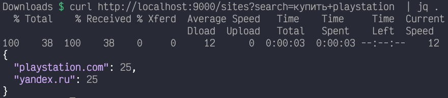

# Задача

Реализовать микросервис на Golang, который позволяет понять во сколько потоков можно парсить определенный сайт без ошибок (нагрузочное тестирование).

Сервису на вход приходит поисковая строка, например “playstation купить”. Из поисковой выдачи Яндекса (готовый парсер тут) получаем список урлов. Далее для каждого урла нужно провести небольшой бенчмарк -- сколько параллельных запросов с одного IP этот урл выдерживает без ошибок. Максимальное время ответа - до 3 секунд. Ответом на исходный GET должна быть мапа “хост” => “рекомендуемое количество одновременных потоков”. 

Обязательные моменты, которые должны быть реализованы:

* сервис должен быть обернут в docker
* взаимодействие через один эндпоинт GET /sites?search=foobar
* с непрогретым кэшом сервис должен отвечать не дольше 30 сек.
* настройка параметров через конфиг

# Решение

Два http сервиса, но можно сделать монолитом

### service

Основной, service, ловит /sites?search= запросы, дергает внутренний сервис для выкачивания yandex-страниц, парсинга и дергает по каждому URL второй сервис - checker. Содержит внутренний кэш на sync.Map. Если после парсинга yandex-страницы по каким-то URL нет статистики в кэше, то дергает по ним checker. По той статистике что есть checker не вызывается. Работает с ограничением ответа в 3 секунды, если за 3 секунды от яндекса или checker не пришел ответ, то отправляет клиенту все что смог собрать на момент таймаута.

### checker

Checker это http сервис, который держит несколько открытых http-клиентов, получает url для тестирования и запускает запросы через своих клиентов одновременно. Содержит внутренний кэш. Получив url от service выполняет нагрузочное тестирование и отдает результат в service. Если service уже отвалился по таймауту все равно продолжает работать, через http-callback обновляя кэш в первом сервисе.

Оба сервиса содержат внутренний кэш, возможно надо поменять на внешний, например на Redis чтобы checker клал результаты для service асинхронно.

Конфигурация через env-переменные:

Service:

* `TIMEOUT` - сколько ждать checker
* `SERVICE_ADDR` - на каком порту запускать
* `CHECKER_URL` - адрес checker
* `YANDEX_FETCHERS` - количество одновременно работающих Yandex-fetchers

Checker:

* `CHECKER_ADDR` - на каком порту пускать
* `CHECKER_FETCHERS` - сколько одновременных клиентов нагружать на страницы
* `SERVICE_URL` - http callback
    
# Запуск

Построено на Makefile и docker-compose

* `make` - компилит cmd/service и cmd/checker в директорию проекта
* `make run1` и `make run2` запускают service и checker локально
* `make docker` - собирает docker images
* `make up` и `make down` - запускают и гасят docker compose

